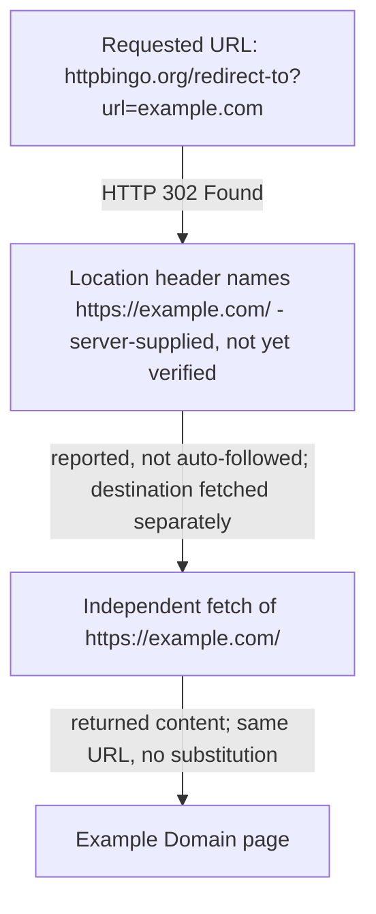

# Evidence Reviewer lens contract

Review only whether material claims in the exact candidate are supported and
faithful to the supplied sources, firsthand record when present, and claim
ledger. Do not perform story, clarity, or copy review.

When `evidence/screenshots.json` is supplied, the validated images are staged
read-only under `context/evidence/assets/screenshots/`. A valid PNG proves
nothing about content. Open each screenshot the candidate relies on and reject
it when the image is blank, a loading or skeleton state, an error or consent
page, or otherwise does not visibly contain the information named by its
`supports` claim and the surrounding prose. Also reject a screenshot the
candidate describes inaccurately. Never edit a screenshot or the manifest.

Every candidate is assembled from a prose draft plus a validated visual plan.
`visual-plan.md` records each evaluated opportunity and `visual-manifest.json`
binds the plan, the source prose, the article, and every placed asset to the
reviewed revision. Verify the factual claims a visual asserts: read each
Mermaid diagram as a statement about relationships, sequences, hierarchies, or
state changes, and reject one whose steps, direction, or labels contradict the
claim ledger, the supplied sources, or the candidate's own prose. Placed images
are staged read-only at the same relative path the candidate references; open
each one and reject an image that does not visibly show what the surrounding
explanation and its alt text claim. Never edit a candidate, a plan, a manifest,
or an asset.


# Shared reviewer output contract

Use only the files under the supplied `context/` directory. Do not inspect its
parent, another workspace, the source repository, `.control/`, `reviews/`, PM
decisions, logs, or another lens's output. Never edit `context/article.md`.
The `context/` directory contains every permitted input and no other run
artifact. Write only `result.json` and `report.md` in the workspace root. Use
status `clean`, `fix_required`, or `blocked`; the exact supplied lens and
revision; and an array of findings. Every finding requires a stable ID,
severity, location, problem, and `suggested_direction`. The report must repeat
every machine finding field verbatim.

For each finding, use these five labels in this order (bullets and blank lines
between fields are optional): `id`, `severity`, `location`, `problem`, and
`suggested_direction`. Do not split a field value across lines.

The JSON field name for the revision is exactly `reviewed_revision` (never
`revision`). Use this exact shape, retaining the finding objects only when
there are findings:

```json
{
  "status": "clean",
  "lens": "evidence",
  "reviewed_revision": "sha256:the-exact-assigned-revision",
  "findings": []
}
```

Before exiting, re-read `result.json` and verify that it contains all four
top-level keys: `status`, `lens`, `reviewed_revision`, and `findings`.


## Assignment

Lens: `evidence`
Candidate: `article-002`
Revision: `sha256:0ee2c2b661745bcb46b7453480c0062550288ec27b59a9ee2af1c499558b2bf5`

## Provided context: brief.md

<write-uuter-context name="brief.md">
# Brief

## Question

What is Example Domain for, and what does its public page visibly say?

## Audience

Technical readers who need a short, source-backed explanation of the reserved example page.

## Provisional takeaway

Example Domain is a deliberately simple public page intended for documentation examples, and its visible wording makes that purpose clear.

## Scope

Describe only the purpose and visible content of the Example Domain page reached through the supplied redirect URL.

## Out of scope

Domain-name history, ownership speculation, browser-provider implementation details, and claims not visible in the supplied source.

## Publication target

A concise standalone article under 350 words.

## Constraints

Use the supplied public sources. Screenshot evidence is required: the Researcher must request exactly one screenshot using ID `shot-001` at `https://httpbingo.org/redirect-to?url=https%3A%2F%2Fexample.com%2F`, supporting the claim that the destination visibly identifies itself as Example Domain and permits use in documentation examples. Do not replace that requested URL with the destination URL. The Visual Editor must inspect the captured pixels against that request and either place the screenshot where it supports the explanation or record an explicit request-keyed rejection.

## Done when

The article accurately states what the page visibly says, the retained screenshot evidence truthfully distinguishes requested and observed final URLs, and the visual decision is explicit and revision-bound if placed.

## Source hints

- https://httpbingo.org/redirect-to?url=https%3A%2F%2Fexample.com%2F
- https://example.com/

</write-uuter-context>

## Provided context: claim-ledger.md

<write-uuter-context name="claim-ledger.md">
# Claim Ledger

Classifications used: Fact, Firsthand observation, Inference, Opinion, Unresolved.

## claim-001
- Statement: The supplied URL `https://httpbingo.org/redirect-to?url=https%3A%2F%2Fexample.com%2F` returns an HTTP 302 redirect whose Location header is `https://example.com/`.
- Classification: Firsthand observation
- Basis: S1. Observed directly via the fetch tool, which reported the redirect status and target rather than silently following it.

## claim-002
- Statement: Following that redirect leads to the page at https://example.com/.
- Classification: Firsthand observation
- Basis: S1 + S2. The redirect target was independently fetched at S2 and returned content, confirming the destination is reachable and is the one named in the redirect, not a substituted URL.

## claim-003
- Statement: The example.com page displays a heading reading "Example Domain".
- Classification: Firsthand observation
- Basis: S2.

## claim-004
- Statement: The page's visible body text states that the domain is for use in documentation examples and does not require permission to use, and it advises against use in "operations."
- Classification: Firsthand observation
- Basis: S2. Caveat: extracted through an AI-mediated fetch/summarization step rather than raw HTML retrieval, so exact sentence boundaries/punctuation are tool-reported. The substance (documentation-example use, no permission needed) is corroborated by the domain's long-established, widely-documented public purpose.
- Screenshot support: shot-001 (requested) is intended to let the Visual Editor independently confirm this claim against captured pixels.

## claim-005
- Statement: The page includes a "Learn more" link to further information (described by the fetch tool as pointing to IANA).
- Classification: Firsthand observation
- Basis: S2.

## claim-006
- Statement: example.com is a domain reserved by IANA for illustrative/documentation use, historically associated with RFC 2606 reserved names.
- Classification: Inference
- Basis: Not independently verified in this run (out of scope per brief: "domain-name history" is excluded). Included only as background context if needed; must not be presented as directly sourced from S1/S2.

## claim-007
- Statement: The exact byte-for-byte HTML wording of the example.com body paragraph, beyond the tool-reported summary in S2.
- Classification: Unresolved
- Basis: No raw-HTML fetch capability was available in this environment (only an AI-mediated WebFetch tool); shell/curl access was not available. The screenshot requested as shot-001 is intended to give the Visual Editor an independent, pixel-level check against this same claim.

</write-uuter-context>

## Provided context: drafts/article-002.md

<write-uuter-context name="drafts/article-002.md">
# What Example Domain Is For

Example Domain is a deliberately plain public page that exists so writers can
put a real domain into documentation examples. That is not a convention someone
has to know in advance: the page at [https://example.com/](https://example.com/)
says so in its own visible text, under a heading that reads "Example Domain".

## Reaching the page

The address that leads there in this case is not example.com itself but a test
utility:
[`https://httpbingo.org/redirect-to?url=https%3A%2F%2Fexample.com%2F`](https://httpbingo.org/redirect-to?url=https%3A%2F%2Fexample.com%2F).



A redirect target is only the server's word for where it intends to send you,
so the destination was fetched separately rather than taken on trust.

## What the page shows

Three things are visible on the destination page: the "Example Domain" heading,
a single short paragraph beneath it, and a "Learn more" link that, per the fetch
tool, points to fuller detail on IANA's site.


Requested: `https://httpbingo.org/redirect-to?url=https%3A%2F%2Fexample.com%2F`.
Observed final URL: `https://example.com/`.

The paragraph is the whole answer. It says the domain is for use in documentation
examples without needing permission, and it advises against use in operations.
Nobody has to ask before writing example.com into a manual or a code sample.

## The limits of this description

The page's text here was read through a fetch tool that summarizes HTML rather
than returning raw markup. The substance is a direct observation: heading,
purpose, permission, and caution all came from the live page on 30 August 2026.
The exact sentence boundaries and punctuation are as that tool reported them,
not byte-verified against the source markup, so treat the wording above as a
faithful report rather than a transcription.

</write-uuter-context>

## Provided context: evidence/firsthand.md

<write-uuter-context name="evidence/firsthand.md">
# Firsthand Work

Two live fetches were performed via the WebFetch tool during this research session (2026-08-30):

1. `https://httpbingo.org/redirect-to?url=https%3A%2F%2Fexample.com%2F` — the tool did not auto-follow the redirect and instead reported the 302 status and the server-supplied `Location` header (`https://example.com/`), explicitly noting it was "not verified" until independently fetched.
2. `https://example.com/` — fetched directly as a follow-up, confirming the redirect target is live and returning the visible heading, body paragraph, and link text described in evidence/sources.md (S2).

No browser rendering, screenshotting, or credentialed access was performed directly by the Researcher; the one requested screenshot (shot-001) is delegated to the controller's capture-runner per the brief's constraints, using the exact redirect URL rather than the resolved destination URL.

</write-uuter-context>

## Provided context: evidence/screenshots.json

<write-uuter-context name="evidence/screenshots.json">
{
  "schema_version": 3,
  "screenshots": [
    {
      "id": "shot-001",
      "path": "evidence/assets/screenshots/shot-001.png",
      "requested_url": "https://httpbingo.org/redirect-to?url=https%3A%2F%2Fexample.com%2F",
      "final_url": "https://example.com/",
      "captured_at": "2026-08-30T10:22:33.371676Z",
      "supports": [
        "claim-004"
      ],
      "reason": "Shows the destination page visibly identifying itself as Example Domain and stating it permits use in documentation examples, reached via the exact supplied redirect URL",
      "backend": "cloudflare-chromium",
      "media_type": "image/png",
      "viewport": {
        "width": 1280,
        "height": 800
      },
      "full_page": false,
      "byte_size": 19303,
      "width": 1280,
      "height": 800,
      "sha256": "sha256:410dd462fa1cc2a7ae84c0feef288195963439a520d826b5a5d44429555d0a59",
      "action_summary": [
        "navigate to the requested public URL",
        "observe the final URL from the capture session",
        "capture the visible viewport as a PNG"
      ],
      "attempt": 1,
      "editorial_outcome": {
        "request_id": "shot-001",
        "status": "usable",
        "reason": "Opened the capture before placing it. It shows a fully rendered page matching the request reason: the bold heading 'Example Domain', a paragraph reading 'This domain is for use in documentation examples without needing permission. Avoid use in operations.', and a 'Learn more' link. It is not a blank or skeleton screen, login or consent page, bot challenge, regional-unavailable page, or generic error. The visible text independently corroborates claim-004 at pixel level and fits the 'What the page shows' section, where the article's only visibility claims sit."
      }
    }
  ]
}

</write-uuter-context>

## Provided context: evidence/sources.md

<write-uuter-context name="evidence/sources.md">
# Sources

## S1 — httpbingo.org redirect endpoint
- Location: https://httpbingo.org/redirect-to?url=https%3A%2F%2Fexample.com%2F
- Accessed: 2026-08-30 (via WebFetch tool)
- Summary: A test-utility endpoint (httpbingo, an httpbin-compatible service) that issues an HTTP 302 Found redirect. The `Location` response header points to `https://example.com/`, matching the `url` query parameter supplied in the request. The tool used to access this page reported the redirect rather than auto-following it, and explicitly flagged the target as "server-supplied, not verified" until independently fetched.
- Use: Establishes that the brief's supplied redirect URL leads to https://example.com/ via a standard 302 redirect, and that this is the destination actually reached, not a substituted URL.

## S2 — example.com landing page
- Location: https://example.com/
- Accessed: 2026-08-30 (via WebFetch tool; fetched separately after following the redirect reported by S1)
- Summary: A minimal single-page site. Visible content extracted by the fetch tool:
  - Heading: "Example Domain"
  - Body paragraph: "This domain is for use in documentation examples without needing permission. Avoid use in operations."
  - A "Learn more" link, pointing (per the tool's description) to further detail on IANA's website.
- Use: Primary evidentiary basis for the article's description of what the page visibly says and what it identifies its own purpose as.
- Caveat: The fetch tool processes raw HTML through an intermediate summarization step rather than returning raw markup verbatim. The heading and general meaning ("for documentation examples," "no permission needed") are consistent with the well-known, long-standing content of this reserved domain, but the exact sentence-level wording returned should be treated as tool-reported rather than independently byte-verified. See claim-ledger for how this caveat is classified.

</write-uuter-context>

## Provided context: revision.txt

<write-uuter-context name="revision.txt">
sha256:0ee2c2b661745bcb46b7453480c0062550288ec27b59a9ee2af1c499558b2bf5

</write-uuter-context>

## Provided context: visuals/article-002/manifest.json

<write-uuter-context name="visuals/article-002/manifest.json">
{
  "schema_version": 1,
  "candidate": 2,
  "source_prose": {
    "path": "drafts/article-002-prose.md",
    "sha256": "sha256:dc6bf537178b3ed4cea5d7b40b95be9b393f62e15b5a9d64e942c49bac00b1a2"
  },
  "plan": {
    "path": "visuals/article-002/plan.md",
    "sha256": "sha256:02ca59dff80ce06318bbc5a6f57f7ef1ee66cb960970569e25086feb0bee12fe"
  },
  "actions": [
    {
      "id": "opp-001-page-screenshot",
      "location": "Section 'What the page shows', beside the paragraph describing the heading, the body paragraph, and the 'Learn more' link.",
      "action": "existing_local_asset",
      "rationale": "This is the only section making claims about what is visible on the page, so a reader gains from seeing the pixels rather than a report of them. The capture corroborates claim-004 independently and gives the pixel-level check that claim-007 leaves open. The Writer's caption must name the requested URL https://httpbingo.org/redirect-to?url=https%3A%2F%2Fexample.com%2F and the observed final URL https://example.com/ as distinct, per the brief, and must not present the image as the requested URL's own content.",
      "asset_id": "shot-001",
      "alt_text": "Screenshot of the example.com page on a light grey background, showing a bold heading reading Example Domain, a paragraph reading This domain is for use in documentation examples without needing permission. Avoid use in operations., and a blue underlined Learn more link beneath it."
    },
    {
      "id": "opp-002-redirect-chain",
      "location": "Section 'Reaching the page', after the sentence naming the httpbingo redirect endpoint.",
      "action": "mermaid",
      "rationale": "The section's content is a relationship between two distinct URLs plus the verification step joining them - the point the article hinges on, since the brief supplies a redirect rather than the destination. The diagram shows requested URL, server-supplied Location value, confirming fetch, and destination at a glance, so the reader sees the destination was confirmed rather than assumed. Every edge traces to claim-001 and claim-002, and the second edge label keeps the qualifier that the target was only the server's word until fetched. The documented chain is linear with no branch or failure outcome, so no decision node is drawn. The Writer should shorten the paragraph to why verification mattered rather than restating the sequence.",
      "mermaid": "flowchart TD\n    A[\"Requested URL: httpbingo.org/redirect-to?url=example.com\"] --\u003e|\"HTTP 302 Found\"| B[\"Location header names https://example.com/ - server-supplied, not yet verified\"]\n    B --\u003e|\"reported, not auto-followed; destination fetched separately\"| C[\"Independent fetch of https://example.com/\"]\n    C --\u003e|\"returned content; same URL, no substitution\"| D[\"Example Domain page\"]"
    },
    {
      "id": "opp-003-visible-elements-list",
      "location": "Section 'What the page shows', first paragraph enumerating the three visible elements.",
      "action": "none",
      "rationale": "Considered turning the three-item enumeration into a bullet list. Rejected: the sentence is one line and already scans, and the screenshot placed alongside it shows all three elements directly. A list would fragment short prose and restate what the image carries, costing space in an article capped under 350 words."
    },
    {
      "id": "opp-004-limits-section",
      "location": "Section 'The limits of this description'.",
      "action": "none",
      "rationale": "Considered a visual separating firsthand observation from tool-reported wording. Rejected: this section states a boundary on confidence, not a relationship, sequence, or hierarchy. Drawing it would give a caveat the visual weight of a structural claim and imply a taxonomy the claim ledger does not assert. Four sentences of prose need no help."
    },
    {
      "id": "opp-005-opening",
      "location": "Opening section under the title 'What Example Domain Is For'.",
      "action": "none",
      "rationale": "The opening is a conclusion-first paragraph of three sentences with no relationship, comparison, or state change to show. A visual here would only delay the answer the section exists to deliver."
    }
  ],
  "assets": [
    {
      "id": "shot-001",
      "opportunity_id": "opp-001-page-screenshot",
      "path": "visuals/article-002/assets/shot-001.png",
      "origin": "screenshot",
      "source": "evidence/assets/screenshots/shot-001.png",
      "media_type": "image/png",
      "byte_size": 19303,
      "sha256": "sha256:410dd462fa1cc2a7ae84c0feef288195963439a520d826b5a5d44429555d0a59",
      "alt_text": "Screenshot of the example.com page on a light grey background, showing a bold heading reading Example Domain, a paragraph reading This domain is for use in documentation examples without needing permission. Avoid use in operations., and a blue underlined Learn more link beneath it."
    }
  ],
  "article": {
    "path": "drafts/article-002.md",
    "sha256": "sha256:8fe10097ff175f0aaae047b4283c9d2a657a8f02a05dbae3732acc4640a56f1e"
  },
  "reviewed_revision": "sha256:0ee2c2b661745bcb46b7453480c0062550288ec27b59a9ee2af1c499558b2bf5",
  "prose_characters_before": 1671,
  "prose_characters_after": 1540
}

</write-uuter-context>

## Provided context: visuals/article-002/plan.md

<write-uuter-context name="visuals/article-002/plan.md">
# Visual plan — article-002

Source prose revision: `sha256:dc6bf537178b3ed4cea5d7b40b95be9b393f62e15b5a9d64e942c49bac00b1a2`

Five opportunities evaluated; two carry a visual, three are recorded as no-visual
decisions. The article is capped under 350 words, so every visual has to earn its
space against prose that already reads well.

---

## opp-001-page-screenshot — `existing_local_asset`

**Location:** Section "What the page shows", beside the paragraph describing the
heading, the body paragraph, and the "Learn more" link.

**Action:** place staged asset `shot-001`.

**Reason:** This is the only section making claims about what is *visible*, and it
is the one place where a reader benefits from seeing the pixels rather than
reading a report of them. I opened the capture before placing it. It shows a fully
rendered page: the bold heading "Example Domain", a paragraph reading "This domain
is for use in documentation examples without needing permission. Avoid use in
operations.", and a "Learn more" link — no blank or skeleton screen, login or
consent wall, bot challenge, regional-unavailable notice, or error page. That
visible content matches the request reason and independently corroborates
claim-004 at pixel level, which is exactly the check claim-007 leaves open. The
caption the Writer adds must name both the **requested** URL
(`https://httpbingo.org/redirect-to?url=https%3A%2F%2Fexample.com%2F`) and the
**observed final** URL (`https://example.com/`) as distinct, per the brief; the
image must not be presented as a capture of the requested URL's own content.

---

## opp-002-redirect-chain — `mermaid`

**Location:** Section "Reaching the page", after the sentence naming the httpbingo
endpoint.

**Action:** inline Mermaid flowchart of the redirect chain.

**Reason:** The section's real content is a relationship between two distinct URLs
and the verification step that connects them — the single point the whole article
hinges on, since the brief supplies a redirect rather than the destination. Prose
has to carry that ordering serially; the diagram shows the requested URL, the
server-supplied `Location` value, the separate confirming fetch, and the
destination in one glance, so a reader can see at once that the destination was
confirmed rather than assumed. Every edge traces to claim-001 and claim-002, and
the label on the second edge preserves the qualifier that the redirect target was
the server's word only until fetched independently. The chain is linear in the
sources — no branch or failure outcome is documented — so no decision node is
drawn. Once the diagram is in place, the Writer should shorten the paragraph to
the *why* (a redirect target is only the server's claim) and let the shape carry
the sequence, rather than stating both in full.

---

## opp-003-visible-elements-list — `none`

**Location:** Section "What the page shows", first paragraph enumerating the three
visible elements.

**Action:** none.

**Reason:** Considered converting the three-item enumeration into a bullet list.
Rejected: the sentence is one line and already scans, and the screenshot placed
immediately alongside it shows all three elements directly. A bullet list here
would fragment short prose and restate what the image already carries, adding
vertical space to an article working under a 350-word cap.

---

## opp-004-limits-section — `none`

**Location:** Section "The limits of this description".

**Action:** none.

**Reason:** Considered a diagram separating firsthand observation from
tool-reported wording. Rejected: this section states a boundary on confidence, not
a relationship, sequence, or hierarchy. Drawing it would give a caveat the visual
weight of a structural claim and imply a taxonomy the claim ledger does not
assert. The prose is four sentences and needs no help.

---

## opp-005-opening — `none`

**Location:** Opening section, "What Example Domain Is For".

**Action:** none.

**Reason:** The opening is a conclusion-first paragraph of three sentences. There
is no relationship, comparison, or state change to show, and an image here would
only delay the answer the section exists to deliver.

---

## Screenshot outcomes

- `shot-001` — **usable**. Visible content matches the request reason and
  claim-004; placed at opp-001-page-screenshot.

</write-uuter-context>