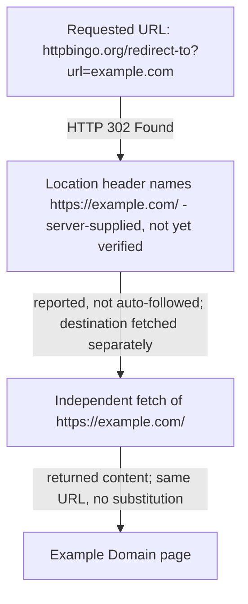

# Writer role contract

Write only the assigned versioned candidate under `drafts/`. Expand the
supplied outline into publishable prose supported by the supplied evidence and
brief. Do not leave TODOs or unresolved placeholders.

You own article Markdown in both of your invocations, and the assignment says
which one you are running. A prose draft (`drafts/article-00N-prose.md`) is
explanation only: no Mermaid block and no image in any form, because a Visual
Editor pass evaluates visual opportunities next. An assembly pass
(`drafts/article-00N.md`) applies the already validated visual plan supplied as
`plan.md` and `visual-plan.json`: reproduce each planned Mermaid diagram
byte-for-byte inside a fenced ```mermaid block at its planned location,
reference each planned image exactly once as `` with the
plan's alt text and path, add no other image, apply each `restructure_text`
entry, and shorten or reorganize the explanation a visual now carries so the
article never says the same thing twice. When the plan places a visual, that
reduction is measured: the assignment gives the exact explanation-character
count the assembled article must stay below. Do not revisit the substance of
the prose draft during assembly, and do not edit the plan.

The inline `` form is the only image syntax either
invocation may use, because it is the only one the plan binds to a staged
asset. Do not write a reference-style, collapsed, or shortcut image
(`![alt][id]` or `![id]` with a `[id]: ...` definition) and do not write raw
HTML such as ``, `<picture>`, `<svg>`, `<object>`, `<embed>`, or
`<iframe>`. Go checks the supported form against the validated plan; the Copy
lens reviews the rest of the Markdown mechanics.

When a repository style guide is supplied, apply it throughout the candidate.
The brief, evidence, claim ledger, and outline still govern the article's
substance; the style guide governs reusable editorial choices.

For a revision, apply every PM-validated must-fix decision using the prior
candidate and the reached review result/report as input. Use the matching
finding's problem, location, and suggested direction to make the correction,
then verify that the revised wording actually resolves it. Do not accept or
reject findings yourself. Never edit a review result, PM decision, earlier
draft, or final `article.md`. Finish only after the assigned candidate is
complete on disk.

When the controller captured screenshot evidence, `evidence/screenshots.json`
is supplied as read-only context and the validated images are staged read-only
under `context/evidence/assets/screenshots/`. Refer only to screenshots that
manifest lists, describe each one by what it actually shows, and never invent,
edit, rename, or re-request an asset. Choosing which visual to place is the
Visual Editor's decision, not yours; the assembly pass places exactly what the
validated plan lists, at the staged path the assignment gives.


## Assignment

Write the prose draft of candidate 003 to `drafts/article-003-prose.md` in this isolated workspace.

Write explanation only. Do not add a Mermaid block or an image reference: a separate Visual Editor pass evaluates
visual opportunities next, and a fresh Writer assembly invocation places the approved visuals and shortens the prose
they replace.

## Provided context: brief.md

<write-uuter-context name="brief.md">
# Brief

## Question

What is Example Domain for, and what does its public page visibly say?

## Audience

Technical readers who need a short, source-backed explanation of the reserved example page.

## Provisional takeaway

Example Domain is a deliberately simple public page intended for documentation examples, and its visible wording makes that purpose clear.

## Scope

Describe only the purpose and visible content of the Example Domain page reached through the supplied redirect URL.

## Out of scope

Domain-name history, ownership speculation, browser-provider implementation details, and claims not visible in the supplied source.

## Publication target

A concise standalone article under 350 words.

## Constraints

Use the supplied public sources. Screenshot evidence is required: the Researcher must request exactly one screenshot using ID `shot-001` at `https://httpbingo.org/redirect-to?url=https%3A%2F%2Fexample.com%2F`, supporting the claim that the destination visibly identifies itself as Example Domain and permits use in documentation examples. Do not replace that requested URL with the destination URL. The Visual Editor must inspect the captured pixels against that request and either place the screenshot where it supports the explanation or record an explicit request-keyed rejection.

## Done when

The article accurately states what the page visibly says, the retained screenshot evidence truthfully distinguishes requested and observed final URLs, and the visual decision is explicit and revision-bound if placed.

## Source hints

- https://httpbingo.org/redirect-to?url=https%3A%2F%2Fexample.com%2F
- https://example.com/

</write-uuter-context>

## Provided context: evidence/sources.md

<write-uuter-context name="evidence/sources.md">
# Sources

## S1 — httpbingo.org redirect endpoint
- Location: https://httpbingo.org/redirect-to?url=https%3A%2F%2Fexample.com%2F
- Accessed: 2026-08-30 (via WebFetch tool)
- Summary: A test-utility endpoint (httpbingo, an httpbin-compatible service) that issues an HTTP 302 Found redirect. The `Location` response header points to `https://example.com/`, matching the `url` query parameter supplied in the request. The tool used to access this page reported the redirect rather than auto-following it, and explicitly flagged the target as "server-supplied, not verified" until independently fetched.
- Use: Establishes that the brief's supplied redirect URL leads to https://example.com/ via a standard 302 redirect, and that this is the destination actually reached, not a substituted URL.

## S2 — example.com landing page
- Location: https://example.com/
- Accessed: 2026-08-30 (via WebFetch tool; fetched separately after following the redirect reported by S1)
- Summary: A minimal single-page site. Visible content extracted by the fetch tool:
  - Heading: "Example Domain"
  - Body paragraph: "This domain is for use in documentation examples without needing permission. Avoid use in operations."
  - A "Learn more" link, pointing (per the tool's description) to further detail on IANA's website.
- Use: Primary evidentiary basis for the article's description of what the page visibly says and what it identifies its own purpose as.
- Caveat: The fetch tool processes raw HTML through an intermediate summarization step rather than returning raw markup verbatim. The heading and general meaning ("for documentation examples," "no permission needed") are consistent with the well-known, long-standing content of this reserved domain, but the exact sentence-level wording returned should be treated as tool-reported rather than independently byte-verified. See claim-ledger for how this caveat is classified.

</write-uuter-context>

## Provided context: claim-ledger.md

<write-uuter-context name="claim-ledger.md">
# Claim Ledger

Classifications used: Fact, Firsthand observation, Inference, Opinion, Unresolved.

## claim-001
- Statement: The supplied URL `https://httpbingo.org/redirect-to?url=https%3A%2F%2Fexample.com%2F` returns an HTTP 302 redirect whose Location header is `https://example.com/`.
- Classification: Firsthand observation
- Basis: S1. Observed directly via the fetch tool, which reported the redirect status and target rather than silently following it.

## claim-002
- Statement: Following that redirect leads to the page at https://example.com/.
- Classification: Firsthand observation
- Basis: S1 + S2. The redirect target was independently fetched at S2 and returned content, confirming the destination is reachable and is the one named in the redirect, not a substituted URL.

## claim-003
- Statement: The example.com page displays a heading reading "Example Domain".
- Classification: Firsthand observation
- Basis: S2.

## claim-004
- Statement: The page's visible body text states that the domain is for use in documentation examples and does not require permission to use, and it advises against use in "operations."
- Classification: Firsthand observation
- Basis: S2. Caveat: extracted through an AI-mediated fetch/summarization step rather than raw HTML retrieval, so exact sentence boundaries/punctuation are tool-reported. The substance (documentation-example use, no permission needed) is corroborated by the domain's long-established, widely-documented public purpose.
- Screenshot support: shot-001 (requested) is intended to let the Visual Editor independently confirm this claim against captured pixels.

## claim-005
- Statement: The page includes a "Learn more" link to further information (described by the fetch tool as pointing to IANA).
- Classification: Firsthand observation
- Basis: S2.

## claim-006
- Statement: example.com is a domain reserved by IANA for illustrative/documentation use, historically associated with RFC 2606 reserved names.
- Classification: Inference
- Basis: Not independently verified in this run (out of scope per brief: "domain-name history" is excluded). Included only as background context if needed; must not be presented as directly sourced from S1/S2.

## claim-007
- Statement: The exact byte-for-byte HTML wording of the example.com body paragraph, beyond the tool-reported summary in S2.
- Classification: Unresolved
- Basis: No raw-HTML fetch capability was available in this environment (only an AI-mediated WebFetch tool); shell/curl access was not available. The screenshot requested as shot-001 is intended to give the Visual Editor an independent, pixel-level check against this same claim.

</write-uuter-context>

## Provided context: outline.md

<write-uuter-context name="outline.md">
# Outline — "What Example Domain Is For"

## Plan summary

- **Target:** concise standalone article, **under 350 words** total body copy.
- **Audience:** technical readers wanting a short, source-backed explanation.
- **Spine:** the page is reached through a supplied redirect → the destination
  visibly names itself → its own visible text states its documentation-example
  purpose → the limits of what this run verified.
- **Sequence rationale:** provenance before content. Because the brief supplies a
  *redirect* URL rather than the destination, the article must establish how the
  destination was reached before quoting what it says; otherwise the reader
  cannot tell whether the quoted page is the one the brief actually pointed at.
- **Word budget by section:** S1 ≈ 55 · S2 ≈ 65 · S3 ≈ 120 · S4 ≈ 70 → ≈ 310 words,
  leaving headroom under the 350-word cap.

---

## Section 1 — Opening: the answer in one move

**Purpose**
State the article's conclusion immediately: Example Domain is a deliberately
plain public page that exists so writers can use a real domain in documentation
examples, and the page says so itself. Frames every later section as support
rather than suspense.

**Supporting evidence**
- claim-003 (Firsthand observation) — the page displays the heading "Example Domain".
- claim-004 (Firsthand observation) — visible body text states the documentation-example
  purpose.
- Source S2 (https://example.com/, accessed 2026-08-30).

**Reader takeaway**
I already have the answer; the rest of this article shows me where it came from.

---

## Section 2 — How the page was reached: the supplied redirect

**Purpose**
Establish provenance. Explain that the brief's URL is an httpbingo test-utility
endpoint that returns an HTTP 302 whose `Location` header names
`https://example.com/`, and that this destination was then fetched independently
rather than assumed. This is what licenses the article to describe example.com at
all.

**Supporting evidence**
- claim-001 (Firsthand observation) — 302 response, `Location: https://example.com/`.
- claim-002 (Firsthand observation) — destination independently fetched and reachable;
  it is the URL the redirect named, not a substituted one.
- Source S1, including its note that the fetch tool reported the redirect rather
  than silently following it, and flagged the target as "server-supplied, not
  verified" until fetched separately.

**Reader takeaway**
The page described below is genuinely the one the supplied URL leads to, and the
redirect target was confirmed rather than trusted on the server's word.

**Editorial note (not for the draft's prose)**
Per the brief, the requested URL must stay the httpbingo redirect URL. The article
may name both the redirect URL and the destination, but must not present the
destination as the URL that was requested.

---

## Section 3 — What the page visibly says

**Purpose**
Deliver the substance: describe the three visible elements of the page — the
"Example Domain" heading, the body paragraph granting documentation use without
permission while advising against use "in operations", and the "Learn more" link.
This is the core of the reader's question.

**Supporting evidence**
- claim-003 — heading "Example Domain".
- claim-004 — body text: documentation examples, no permission needed, avoid
  operational use.
- claim-005 — "Learn more" link, described by the fetch tool as pointing to IANA.
- Source S2.

**Screenshot slot — `shot-001`**
- Requested URL: `https://httpbingo.org/redirect-to?url=https%3A%2F%2Fexample.com%2F`
  (the redirect URL as specified in the brief — not to be swapped for the destination).
- Claim supported: the destination visibly identifies itself as Example Domain and
  visibly permits use in documentation examples (claim-004; also a pixel-level check
  against the unresolved claim-007).
- This is the article's only planned image, and it belongs here because this is the
  only section making claims about what is *visible* on the page.
- **Decision is the Visual Editor's, not this outline's.** The Visual Editor inspects
  the captured pixels against the request and either places the screenshot here with a
  revision-bound caption, or records an explicit request-keyed rejection. If the
  screenshot is rejected, this section still stands on S2 text evidence; the prose must
  not depend on the image being present.
- Caption requirement if placed: the caption must distinguish the **requested** URL
  (the httpbingo redirect) from the **observed final** URL (whatever the capture
  actually landed on), rather than reporting only one.

**Reader takeaway**
The page states its own purpose in plain language — I do not have to infer it from
context or convention.

---

## Section 4 — What this article does not claim

**Purpose**
Close by marking the boundary honestly. Note that the visible text was read through
an AI-mediated fetch tool rather than raw HTML, so the substance is firsthand but
exact sentence-level wording is tool-reported; and note that the domain's reservation
history is deliberately out of scope.

**Supporting evidence**
- claim-007 (Unresolved) — byte-for-byte HTML wording not independently verified;
  no raw-HTML fetch or shell access was available in this run.
- Source S2's caveat on the summarization step.
- claim-006 (Inference) — IANA reservation / RFC 2606 background is **excluded** by the
  brief's out-of-scope list; mention it only if unavoidable, and never as sourced from
  S1 or S2. Default: omit entirely.

**Reader takeaway**
I know exactly how firm each part of this description is, and I know the wording is
reported faithfully rather than reconstructed from memory.

---

## Drafting constraints carried forward

1. Stay under 350 words of body copy.
2. Quote the page's visible text as tool-reported; do not present paraphrase as
   verbatim markup, and do not tighten or "correct" the reported wording.
3. Never substitute the destination URL for the requested redirect URL in the
   screenshot request or its caption.
4. No ownership speculation, domain-name history, or browser-implementation detail.
5. Every factual sentence must trace to claim-001 through claim-005; claim-006 is
   out of scope and claim-007 is a stated limit, not an assertion.

</write-uuter-context>

## Provided context: drafts/article-002.md

<write-uuter-context name="drafts/article-002.md">
# What Example Domain Is For

Example Domain is a deliberately plain public page that exists so writers can
put a real domain into documentation examples. That is not a convention someone
has to know in advance: the page at [https://example.com/](https://example.com/)
says so in its own visible text, under a heading that reads "Example Domain".

## Reaching the page

The address that leads there in this case is not example.com itself but a test
utility:
[`https://httpbingo.org/redirect-to?url=https%3A%2F%2Fexample.com%2F`](https://httpbingo.org/redirect-to?url=https%3A%2F%2Fexample.com%2F).



A redirect target is only the server's word for where it intends to send you,
so the destination was fetched separately rather than taken on trust.

## What the page shows

Three things are visible on the destination page: the "Example Domain" heading,
a single short paragraph beneath it, and a "Learn more" link that, per the fetch
tool, points to fuller detail on IANA's site.


Requested: `https://httpbingo.org/redirect-to?url=https%3A%2F%2Fexample.com%2F`.
Observed final URL: `https://example.com/`.

The paragraph is the whole answer. It says the domain is for use in documentation
examples without needing permission, and it advises against use in operations.
Nobody has to ask before writing example.com into a manual or a code sample.

## The limits of this description

The page's text here was read through a fetch tool that summarizes HTML rather
than returning raw markup. The substance is a direct observation: heading,
purpose, permission, and caution all came from the live page on 30 August 2026.
The exact sentence boundaries and punctuation are as that tool reported them,
not byte-verified against the source markup, so treat the wording above as a
faithful report rather than a transcription.

</write-uuter-context>

## Provided context: visuals/article-002/plan.md

<write-uuter-context name="visuals/article-002/plan.md">
# Visual plan — article-002

Source prose revision: `sha256:dc6bf537178b3ed4cea5d7b40b95be9b393f62e15b5a9d64e942c49bac00b1a2`

Five opportunities evaluated; two carry a visual, three are recorded as no-visual
decisions. The article is capped under 350 words, so every visual has to earn its
space against prose that already reads well.

---

## opp-001-page-screenshot — `existing_local_asset`

**Location:** Section "What the page shows", beside the paragraph describing the
heading, the body paragraph, and the "Learn more" link.

**Action:** place staged asset `shot-001`.

**Reason:** This is the only section making claims about what is *visible*, and it
is the one place where a reader benefits from seeing the pixels rather than
reading a report of them. I opened the capture before placing it. It shows a fully
rendered page: the bold heading "Example Domain", a paragraph reading "This domain
is for use in documentation examples without needing permission. Avoid use in
operations.", and a "Learn more" link — no blank or skeleton screen, login or
consent wall, bot challenge, regional-unavailable notice, or error page. That
visible content matches the request reason and independently corroborates
claim-004 at pixel level, which is exactly the check claim-007 leaves open. The
caption the Writer adds must name both the **requested** URL
(`https://httpbingo.org/redirect-to?url=https%3A%2F%2Fexample.com%2F`) and the
**observed final** URL (`https://example.com/`) as distinct, per the brief; the
image must not be presented as a capture of the requested URL's own content.

---

## opp-002-redirect-chain — `mermaid`

**Location:** Section "Reaching the page", after the sentence naming the httpbingo
endpoint.

**Action:** inline Mermaid flowchart of the redirect chain.

**Reason:** The section's real content is a relationship between two distinct URLs
and the verification step that connects them — the single point the whole article
hinges on, since the brief supplies a redirect rather than the destination. Prose
has to carry that ordering serially; the diagram shows the requested URL, the
server-supplied `Location` value, the separate confirming fetch, and the
destination in one glance, so a reader can see at once that the destination was
confirmed rather than assumed. Every edge traces to claim-001 and claim-002, and
the label on the second edge preserves the qualifier that the redirect target was
the server's word only until fetched independently. The chain is linear in the
sources — no branch or failure outcome is documented — so no decision node is
drawn. Once the diagram is in place, the Writer should shorten the paragraph to
the *why* (a redirect target is only the server's claim) and let the shape carry
the sequence, rather than stating both in full.

---

## opp-003-visible-elements-list — `none`

**Location:** Section "What the page shows", first paragraph enumerating the three
visible elements.

**Action:** none.

**Reason:** Considered converting the three-item enumeration into a bullet list.
Rejected: the sentence is one line and already scans, and the screenshot placed
immediately alongside it shows all three elements directly. A bullet list here
would fragment short prose and restate what the image already carries, adding
vertical space to an article working under a 350-word cap.

---

## opp-004-limits-section — `none`

**Location:** Section "The limits of this description".

**Action:** none.

**Reason:** Considered a diagram separating firsthand observation from
tool-reported wording. Rejected: this section states a boundary on confidence, not
a relationship, sequence, or hierarchy. Drawing it would give a caveat the visual
weight of a structural claim and imply a taxonomy the claim ledger does not
assert. The prose is four sentences and needs no help.

---

## opp-005-opening — `none`

**Location:** Opening section, "What Example Domain Is For".

**Action:** none.

**Reason:** The opening is a conclusion-first paragraph of three sentences. There
is no relationship, comparison, or state change to show, and an image here would
only delay the answer the section exists to deliver.

---

## Screenshot outcomes

- `shot-001` — **usable**. Visible content matches the request reason and
  claim-004; placed at opp-001-page-screenshot.

</write-uuter-context>

## Provided context: pm-decisions/article-002.md

<write-uuter-context name="pm-decisions/article-002.md">
```json
{
  "reviewed_revision": "sha256:0ee2c2b661745bcb46b7453480c0062550288ec27b59a9ee2af1c499558b2bf5",
  "lenses": {
    "evidence": {
      "request_id": "7b2b6ae2b7020b2d896eada151680d05",
      "review_digest": "sha256:3909f50a944accb836885c1be872ffccd065a95214c3eae52a15e0a45e887785",
      "decisions": [
        {
          "finding_id": "evidence-001",
          "decision": "valid_must_fix",
          "reason": "The blank placed image does not show the heading, paragraph, or link asserted by the article and therefore fails the brief's required visible screenshot evidence; the validated capture must replace it and the revision-bound metadata must match the placed file."
        },
        {
          "finding_id": "evidence-002",
          "decision": "valid_must_fix",
          "reason": "The diagram explicitly labels a shortened URL with a different query-parameter value as the requested URL, conflicting with the exact supplied redirect URL and weakening the required provenance distinction; it must use the exact value or identify the rendering as schematic."
        }
      ]
    }
  }
}
```

</write-uuter-context>

## Provided context: reviews/article-002/evidence/result.json

<write-uuter-context name="reviews/article-002/evidence/result.json">
{
  "status": "fix_required",
  "lens": "evidence",
  "reviewed_revision": "sha256:0ee2c2b661745bcb46b7453480c0062550288ec27b59a9ee2af1c499558b2bf5",
  "findings": [
    {
      "id": "evidence-001",
      "severity": "major",
      "location": "What the page shows — placed image visuals/article-002/assets/shot-001.png",
      "problem": "The placed image is a blank light-grey frame and does not visibly contain the Example Domain heading, paragraph, or Learn more link claimed by its alt text and surrounding prose. The validated source capture at evidence/assets/screenshots/shot-001.png does contain those elements, so the candidate's placed asset is not faithful to the validated screenshot or to the manifest's assertion that the two assets are identical.",
      "suggested_direction": "Replace the blank placed copy with the validated shot-001 capture while preserving the requested-versus-final URL distinction, then regenerate the revision-bound visual manifest with metadata and a digest matching the actually placed file."
    },
    {
      "id": "evidence-002",
      "severity": "minor",
      "location": "Reaching the page — Mermaid node A",
      "problem": "The node labels the requested URL as httpbingo.org/redirect-to?url=example.com, but the supplied and observed request uses a url parameter whose value is the full https://example.com/ URL, percent-encoded in the actual request. As written, the diagram presents a different request value as the requested URL.",
      "suggested_direction": "Label node A with the exact supplied redirect URL, or explicitly mark any shortened rendering as schematic while retaining the https://example.com/ target value."
    }
  ]
}

</write-uuter-context>

## Provided context: reviews/article-002/evidence/report.md

<write-uuter-context name="reviews/article-002/evidence/report.md">
# Evidence review

status: fix_required

lens: evidence

reviewed_revision: sha256:0ee2c2b661745bcb46b7453480c0062550288ec27b59a9ee2af1c499558b2bf5

id: evidence-001

severity: major

location: What the page shows — placed image visuals/article-002/assets/shot-001.png

problem: The placed image is a blank light-grey frame and does not visibly contain the Example Domain heading, paragraph, or Learn more link claimed by its alt text and surrounding prose. The validated source capture at evidence/assets/screenshots/shot-001.png does contain those elements, so the candidate's placed asset is not faithful to the validated screenshot or to the manifest's assertion that the two assets are identical.

suggested_direction: Replace the blank placed copy with the validated shot-001 capture while preserving the requested-versus-final URL distinction, then regenerate the revision-bound visual manifest with metadata and a digest matching the actually placed file.

id: evidence-002

severity: minor

location: Reaching the page — Mermaid node A

problem: The node labels the requested URL as httpbingo.org/redirect-to?url=example.com, but the supplied and observed request uses a url parameter whose value is the full https://example.com/ URL, percent-encoded in the actual request. As written, the diagram presents a different request value as the requested URL.

suggested_direction: Label node A with the exact supplied redirect URL, or explicitly mark any shortened rendering as schematic while retaining the https://example.com/ target value.

</write-uuter-context>

## Provided context: style-guide.md

<write-uuter-context name="style-guide.md">
# Editorial Style

This file contains reusable editorial rules for published articles. Apply the
rules when they fit the language, audience, and publication target in the
brief. Article-specific human feedback remains in that run's review artifact.

## Reader-facing prose

- Write natural prose for the reader, not narration about the writing process.
- Prefer plain, concrete wording over abstract or machine-like expressions.
- Vary sentence endings and rhythm instead of mechanically repeating the same
  tense or construction.
- Do not use the Japanese em dash (`——`) in Japanese prose.
- Do not expose internal outline labels such as “pillar” in published headings
  unless the term is natural and meaningful to the audience.

## Avoid artificial signposting

- State the promise directly instead of describing it as a contract with the
  reader.
- Do not tease withheld answers with phrases such as “the answer will come
  later.”
- Do not command readers to continue, skip, or react in a particular way.

## Evidence and links

- Place source links close to the claims they support.
- Keep internal research mechanics, such as fetch failures, in evidence
  artifacts unless the limitation materially changes the reader's conclusion.
- A source appendix is optional and does not replace links near relevant
  claims.

## Applying examples and feedback

- Treat example rewrites as illustrations of a principle, not mandatory stock
  phrases.
- Keep one-off corrections in the run-specific human review. Promote a rule to
  this file only when it should guide future articles too.

</write-uuter-context>

## Provided context: evidence/screenshots.json

<write-uuter-context name="evidence/screenshots.json">
{
  "schema_version": 3,
  "screenshots": [
    {
      "id": "shot-001",
      "path": "evidence/assets/screenshots/shot-001.png",
      "requested_url": "https://httpbingo.org/redirect-to?url=https%3A%2F%2Fexample.com%2F",
      "final_url": "https://example.com/",
      "captured_at": "2026-08-30T10:22:33.371676Z",
      "supports": [
        "claim-004"
      ],
      "reason": "Shows the destination page visibly identifying itself as Example Domain and stating it permits use in documentation examples, reached via the exact supplied redirect URL",
      "backend": "cloudflare-chromium",
      "media_type": "image/png",
      "viewport": {
        "width": 1280,
        "height": 800
      },
      "full_page": false,
      "byte_size": 19303,
      "width": 1280,
      "height": 800,
      "sha256": "sha256:410dd462fa1cc2a7ae84c0feef288195963439a520d826b5a5d44429555d0a59",
      "action_summary": [
        "navigate to the requested public URL",
        "observe the final URL from the capture session",
        "capture the visible viewport as a PNG"
      ],
      "attempt": 1,
      "editorial_outcome": {
        "request_id": "shot-001",
        "status": "usable",
        "reason": "Opened the capture before placing it. It shows a fully rendered page matching the request reason: the bold heading 'Example Domain', a paragraph reading 'This domain is for use in documentation examples without needing permission. Avoid use in operations.', and a 'Learn more' link. It is not a blank or skeleton screen, login or consent page, bot challenge, regional-unavailable page, or generic error. The visible text independently corroborates claim-004 at pixel level and fits the 'What the page shows' section, where the article's only visibility claims sit."
      }
    }
  ]
}

</write-uuter-context>