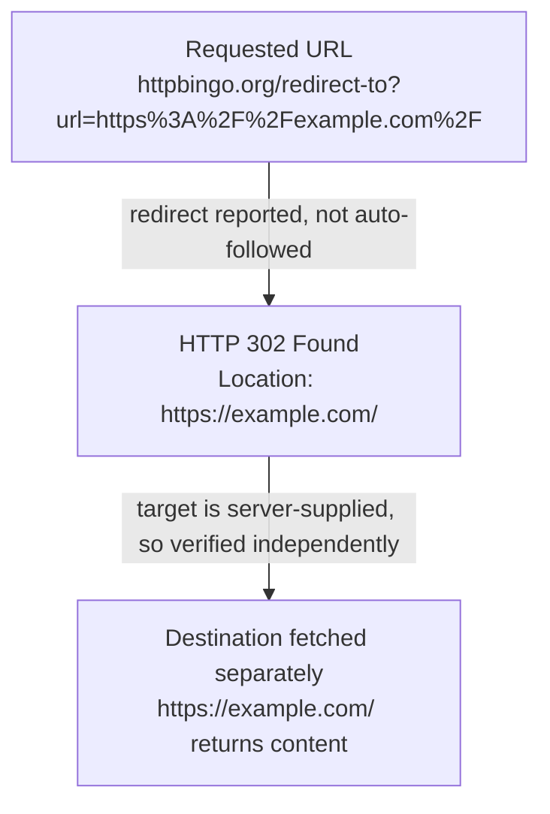

# Evidence Reviewer lens contract

Review only whether material claims in the exact candidate are supported and
faithful to the supplied sources, firsthand record when present, and claim
ledger. Do not perform story, clarity, or copy review.

When `evidence/screenshots.json` is supplied, the validated images are staged
read-only under `context/evidence/assets/screenshots/`. A valid PNG proves
nothing about content. Open each screenshot the candidate relies on and reject
it when the image is blank, a loading or skeleton state, an error or consent
page, or otherwise does not visibly contain the information named by its
`supports` claim and the surrounding prose. Also reject a screenshot the
candidate describes inaccurately. Never edit a screenshot or the manifest.

Every candidate is assembled from a prose draft plus a validated visual plan.
`visual-plan.md` records each evaluated opportunity and `visual-manifest.json`
binds the plan, the source prose, the article, and every placed asset to the
reviewed revision. Verify the factual claims a visual asserts: read each
Mermaid diagram as a statement about relationships, sequences, hierarchies, or
state changes, and reject one whose steps, direction, or labels contradict the
claim ledger, the supplied sources, or the candidate's own prose. Placed images
are staged read-only at the same relative path the candidate references; open
each one and reject an image that does not visibly show what the surrounding
explanation and its alt text claim. Never edit a candidate, a plan, a manifest,
or an asset.


# Shared reviewer output contract

Use only the files under the supplied `context/` directory. Do not inspect its
parent, another workspace, the source repository, `.control/`, `reviews/`, PM
decisions, logs, or another lens's output. Never edit `context/article.md`.
The `context/` directory contains every permitted input and no other run
artifact. Write only `result.json` and `report.md` in the workspace root. Use
status `clean`, `fix_required`, or `blocked`; the exact supplied lens and
revision; and an array of findings. Every finding requires a stable ID,
severity, location, problem, and `suggested_direction`. The report must repeat
every machine finding field verbatim.

For each finding, use these five labels in this order (bullets and blank lines
between fields are optional): `id`, `severity`, `location`, `problem`, and
`suggested_direction`. Do not split a field value across lines.

The JSON field name for the revision is exactly `reviewed_revision` (never
`revision`). Use this exact shape, retaining the finding objects only when
there are findings:

```json
{
  "status": "clean",
  "lens": "evidence",
  "reviewed_revision": "sha256:the-exact-assigned-revision",
  "findings": []
}
```

Before exiting, re-read `result.json` and verify that it contains all four
top-level keys: `status`, `lens`, `reviewed_revision`, and `findings`.


## Assignment

Lens: `evidence`
Candidate: `article-003`
Revision: `sha256:efa0440b31351a5db3a46d5c408d68220e6a9f38d42cd9463ec62dc06f665007`

## Provided context: brief.md

<write-uuter-context name="brief.md">
# Brief

## Question

What is Example Domain for, and what does its public page visibly say?

## Audience

Technical readers who need a short, source-backed explanation of the reserved example page.

## Provisional takeaway

Example Domain is a deliberately simple public page intended for documentation examples, and its visible wording makes that purpose clear.

## Scope

Describe only the purpose and visible content of the Example Domain page reached through the supplied redirect URL.

## Out of scope

Domain-name history, ownership speculation, browser-provider implementation details, and claims not visible in the supplied source.

## Publication target

A concise standalone article under 350 words.

## Constraints

Use the supplied public sources. Screenshot evidence is required: the Researcher must request exactly one screenshot using ID `shot-001` at `https://httpbingo.org/redirect-to?url=https%3A%2F%2Fexample.com%2F`, supporting the claim that the destination visibly identifies itself as Example Domain and permits use in documentation examples. Do not replace that requested URL with the destination URL. The Visual Editor must inspect the captured pixels against that request and either place the screenshot where it supports the explanation or record an explicit request-keyed rejection.

## Done when

The article accurately states what the page visibly says, the retained screenshot evidence truthfully distinguishes requested and observed final URLs, and the visual decision is explicit and revision-bound if placed.

## Source hints

- https://httpbingo.org/redirect-to?url=https%3A%2F%2Fexample.com%2F
- https://example.com/

</write-uuter-context>

## Provided context: claim-ledger.md

<write-uuter-context name="claim-ledger.md">
# Claim Ledger

Classifications used: Fact, Firsthand observation, Inference, Opinion, Unresolved.

## claim-001
- Statement: The supplied URL `https://httpbingo.org/redirect-to?url=https%3A%2F%2Fexample.com%2F` returns an HTTP 302 redirect whose Location header is `https://example.com/`.
- Classification: Firsthand observation
- Basis: S1. Observed directly via the fetch tool, which reported the redirect status and target rather than silently following it.

## claim-002
- Statement: Following that redirect leads to the page at https://example.com/.
- Classification: Firsthand observation
- Basis: S1 + S2. The redirect target was independently fetched at S2 and returned content, confirming the destination is reachable and is the one named in the redirect, not a substituted URL.

## claim-003
- Statement: The example.com page displays a heading reading "Example Domain".
- Classification: Firsthand observation
- Basis: S2.

## claim-004
- Statement: The page's visible body text states that the domain is for use in documentation examples and does not require permission to use, and it advises against use in "operations."
- Classification: Firsthand observation
- Basis: S2. Caveat: extracted through an AI-mediated fetch/summarization step rather than raw HTML retrieval, so exact sentence boundaries/punctuation are tool-reported. The substance (documentation-example use, no permission needed) is corroborated by the domain's long-established, widely-documented public purpose.
- Screenshot support: shot-001 (requested) is intended to let the Visual Editor independently confirm this claim against captured pixels.

## claim-005
- Statement: The page includes a "Learn more" link to further information (described by the fetch tool as pointing to IANA).
- Classification: Firsthand observation
- Basis: S2.

## claim-006
- Statement: example.com is a domain reserved by IANA for illustrative/documentation use, historically associated with RFC 2606 reserved names.
- Classification: Inference
- Basis: Not independently verified in this run (out of scope per brief: "domain-name history" is excluded). Included only as background context if needed; must not be presented as directly sourced from S1/S2.

## claim-007
- Statement: The exact byte-for-byte HTML wording of the example.com body paragraph, beyond the tool-reported summary in S2.
- Classification: Unresolved
- Basis: No raw-HTML fetch capability was available in this environment (only an AI-mediated WebFetch tool); shell/curl access was not available. The screenshot requested as shot-001 is intended to give the Visual Editor an independent, pixel-level check against this same claim.

</write-uuter-context>

## Provided context: drafts/article-003.md

<write-uuter-context name="drafts/article-003.md">
# What Example Domain Is For

Example Domain is a deliberately plain public page that exists so writers can
put a real domain into documentation examples. That is not a convention someone
has to know in advance: the page at [https://example.com/](https://example.com/)
says so in its own visible text, under a heading that reads "Example Domain".

## Reaching the page

The address that leads there in this case is not example.com itself but a test
utility, [httpbingo's `redirect-to` endpoint](https://httpbingo.org/redirect-to?url=https%3A%2F%2Fexample.com%2F).



A redirect target is only the server's word for where it intends to send you,
so the destination was fetched separately rather than taken on trust.

## What the page shows

Three things are visible on the destination page: the "Example Domain" heading,
a single short paragraph beneath it, and a "Learn more" link that, per the fetch
tool, points to fuller detail on IANA's site.

The paragraph is the whole answer. It says the domain is for use in documentation
examples without needing permission, and it advises against use in operations.
Nobody has to ask before writing example.com into a manual or a code sample.


*Requested URL: `https://httpbingo.org/redirect-to?url=https%3A%2F%2Fexample.com%2F`;
observed final URL: `https://example.com/`.*

## The limits of this description

The page's text here was read through a fetch tool that summarizes HTML rather
than returning raw markup. The substance is a direct observation: heading,
purpose, permission, and caution all came from the live page on 30 August 2026.
The exact sentence boundaries and punctuation are as that tool reported them,
not byte-verified against the source markup, so treat the wording above as a
faithful report rather than a transcription.

</write-uuter-context>

## Provided context: evidence/firsthand.md

<write-uuter-context name="evidence/firsthand.md">
# Firsthand Work

Two live fetches were performed via the WebFetch tool during this research session (2026-08-30):

1. `https://httpbingo.org/redirect-to?url=https%3A%2F%2Fexample.com%2F` — the tool did not auto-follow the redirect and instead reported the 302 status and the server-supplied `Location` header (`https://example.com/`), explicitly noting it was "not verified" until independently fetched.
2. `https://example.com/` — fetched directly as a follow-up, confirming the redirect target is live and returning the visible heading, body paragraph, and link text described in evidence/sources.md (S2).

No browser rendering, screenshotting, or credentialed access was performed directly by the Researcher; the one requested screenshot (shot-001) is delegated to the controller's capture-runner per the brief's constraints, using the exact redirect URL rather than the resolved destination URL.

</write-uuter-context>

## Provided context: evidence/screenshots.json

<write-uuter-context name="evidence/screenshots.json">
{
  "schema_version": 3,
  "screenshots": [
    {
      "id": "shot-001",
      "path": "evidence/assets/screenshots/shot-001.png",
      "requested_url": "https://httpbingo.org/redirect-to?url=https%3A%2F%2Fexample.com%2F",
      "final_url": "https://example.com/",
      "captured_at": "2026-08-30T10:22:33.371676Z",
      "supports": [
        "claim-004"
      ],
      "reason": "Shows the destination page visibly identifying itself as Example Domain and stating it permits use in documentation examples, reached via the exact supplied redirect URL",
      "backend": "cloudflare-chromium",
      "media_type": "image/png",
      "viewport": {
        "width": 1280,
        "height": 800
      },
      "full_page": false,
      "byte_size": 19303,
      "width": 1280,
      "height": 800,
      "sha256": "sha256:410dd462fa1cc2a7ae84c0feef288195963439a520d826b5a5d44429555d0a59",
      "action_summary": [
        "navigate to the requested public URL",
        "observe the final URL from the capture session",
        "capture the visible viewport as a PNG"
      ],
      "attempt": 1,
      "editorial_outcome": {
        "request_id": "shot-001",
        "status": "usable",
        "reason": "Opened the staged capture before planning placement. It shows a fully rendered page on a plain light grey background: a bold heading reading Example Domain, a paragraph reading This domain is for use in documentation examples without needing permission. Avoid use in operations., and a blue underlined Learn more link. That matches the request reason - the destination visibly identifies itself as Example Domain and visibly permits documentation use - and independently corroborates claim-004 at pixel level while also answering the unresolved claim-007. It is not a blank or skeleton screen, login or consent page, bot challenge, regional-unavailable page, or generic error. It fits the What the page shows section, the only part of the article making visibility claims."
      }
    }
  ]
}

</write-uuter-context>

## Provided context: evidence/sources.md

<write-uuter-context name="evidence/sources.md">
# Sources

## S1 — httpbingo.org redirect endpoint
- Location: https://httpbingo.org/redirect-to?url=https%3A%2F%2Fexample.com%2F
- Accessed: 2026-08-30 (via WebFetch tool)
- Summary: A test-utility endpoint (httpbingo, an httpbin-compatible service) that issues an HTTP 302 Found redirect. The `Location` response header points to `https://example.com/`, matching the `url` query parameter supplied in the request. The tool used to access this page reported the redirect rather than auto-following it, and explicitly flagged the target as "server-supplied, not verified" until independently fetched.
- Use: Establishes that the brief's supplied redirect URL leads to https://example.com/ via a standard 302 redirect, and that this is the destination actually reached, not a substituted URL.

## S2 — example.com landing page
- Location: https://example.com/
- Accessed: 2026-08-30 (via WebFetch tool; fetched separately after following the redirect reported by S1)
- Summary: A minimal single-page site. Visible content extracted by the fetch tool:
  - Heading: "Example Domain"
  - Body paragraph: "This domain is for use in documentation examples without needing permission. Avoid use in operations."
  - A "Learn more" link, pointing (per the tool's description) to further detail on IANA's website.
- Use: Primary evidentiary basis for the article's description of what the page visibly says and what it identifies its own purpose as.
- Caveat: The fetch tool processes raw HTML through an intermediate summarization step rather than returning raw markup verbatim. The heading and general meaning ("for documentation examples," "no permission needed") are consistent with the well-known, long-standing content of this reserved domain, but the exact sentence-level wording returned should be treated as tool-reported rather than independently byte-verified. See claim-ledger for how this caveat is classified.

</write-uuter-context>

## Provided context: revision.txt

<write-uuter-context name="revision.txt">
sha256:efa0440b31351a5db3a46d5c408d68220e6a9f38d42cd9463ec62dc06f665007

</write-uuter-context>

## Provided context: visuals/article-003/manifest.json

<write-uuter-context name="visuals/article-003/manifest.json">
{
  "schema_version": 1,
  "candidate": 3,
  "source_prose": {
    "path": "drafts/article-003-prose.md",
    "sha256": "sha256:bf96909840998080db3bdf680db2cb53e452bd80e8c7f426f96406c2bb496f07"
  },
  "plan": {
    "path": "visuals/article-003/plan.md",
    "sha256": "sha256:3e38b427eaa07a2be75f3bbc95368db82d6443cebedd00b7cf78cef01b391c86"
  },
  "actions": [
    {
      "id": "opp-001-redirect-provenance",
      "location": "Section 'Reaching the page', the paragraph beginning 'The address that leads there in this case is not example.com itself but a test utility'.",
      "action": "mermaid",
      "rationale": "The paragraph carries the article's provenance chain in continuous prose: three distinct URL states plus the point where the server's word stopped being trusted. That is a sequence, easier held as a shape than as sentences that keep re-introducing long percent-encoded URLs. The diagram also fixes the requested-versus-destination distinction the brief depends on, drawing the httpbingo endpoint and https://example.com/ as separate nodes so neither reads as the other. Edge labels carry the qualifications the prose supplies - the redirect was reported rather than auto-followed, and the target was server-supplied and so verified independently - so no edge claims more than claim-001 and claim-002 support. The Writer can then shorten the paragraph to its interpretive point instead of restating each hop.",
      "mermaid": "flowchart TD\n    A[\"Requested URL\u003cbr/\u003ehttpbingo.org/redirect-to?url=https%3A%2F%2Fexample.com%2F\"]\n    B[\"HTTP 302 Found\u003cbr/\u003eLocation: https://example.com/\"]\n    C[\"Destination fetched separately\u003cbr/\u003ehttps://example.com/ returns content\"]\n    A --\u003e|\"redirect reported, not auto-followed\"| B\n    B --\u003e|\"target is server-supplied, so verified independently\"| C"
    },
    {
      "id": "opp-002-page-screenshot",
      "location": "Section 'What the page shows', immediately after the paragraph beginning 'The paragraph is the whole answer.'",
      "action": "existing_local_asset",
      "rationale": "This is the only section making claims about what is visible, and it rests on the article's weakest evidence: the closing section concedes the text was read through a summarizing fetch tool rather than raw markup, so wording is tool-reported. The screenshot is the independent pixel-level check against that limit, letting the reader see the heading and the permission sentence instead of accepting a report of them. I inspected the file first and confirmed it is a real rendered page, not a blank, consent, challenge, or error state. Caption requirement for the Writer: name both the requested URL https://httpbingo.org/redirect-to?url=https%3A%2F%2Fexample.com%2F and the observed final URL https://example.com/, never one in place of the other. Alt text describes the rendered page only and asserts no URL.",
      "asset_id": "shot-001",
      "alt_text": "Screenshot of a plain light grey web page showing a bold dark heading reading Example Domain, below it a paragraph reading This domain is for use in documentation examples without needing permission. Avoid use in operations., and below that a blue underlined Learn more link. The rest of the page is empty."
    },
    {
      "id": "opp-003-visible-elements-list",
      "location": "Section 'What the page shows', the sentence beginning 'Three things are visible on the destination page'.",
      "action": "none",
      "rationale": "Considered converting the enumeration into a three-item bullet list. Rejected: it is already one short scannable sentence in a two-paragraph section, so a list would fragment it without aiding scanning. Also considered whether it becomes redundant once shot-001 sits above it. It does not - the draft's framing requires the prose to stand without the image, and the enumeration is what keeps the section readable for anyone not seeing the screenshot. The sentence names the elements, the image evidences them, so this is not the same explanation stated twice."
    },
    {
      "id": "opp-004-limits-section",
      "location": "Section 'The limits of this description', entire section.",
      "action": "none",
      "rationale": "The section is an epistemic caveat about how the text was obtained - firsthand substance, tool-reported punctuation. That is a claim about confidence, not a relationship, sequence, hierarchy, or state change, so no shape fits it. Drawing raw HTML to tool to summary as a pipeline would imply a verified processing chain this run never observed, which the claim ledger does not support at claim-007. Three sentences of plain prose is the honest form."
    },
    {
      "id": "opp-005-opening",
      "location": "Opening section, from 'Example Domain is a deliberately plain public page' through the quoted heading.",
      "action": "none",
      "rationale": "The opening is a single paragraph delivering the conclusion, meant to be read straight through in seconds. It is not dense, not long, and not a relationship. A visual here would delay the answer the paragraph exists to give, and the screenshot is deliberately held back to the section that actually makes visibility claims."
    }
  ],
  "assets": [
    {
      "id": "shot-001",
      "opportunity_id": "opp-002-page-screenshot",
      "path": "visuals/article-003/assets/shot-001.png",
      "origin": "screenshot",
      "source": "evidence/assets/screenshots/shot-001.png",
      "media_type": "image/png",
      "byte_size": 19303,
      "sha256": "sha256:410dd462fa1cc2a7ae84c0feef288195963439a520d826b5a5d44429555d0a59",
      "alt_text": "Screenshot of a plain light grey web page showing a bold dark heading reading Example Domain, below it a paragraph reading This domain is for use in documentation examples without needing permission. Avoid use in operations., and below that a blue underlined Learn more link. The rest of the page is empty."
    }
  ],
  "article": {
    "path": "drafts/article-003.md",
    "sha256": "sha256:15361ce41b2735f1046cd620f52d593f5775252afd775f26eb7a9ff6096c99e2"
  },
  "reviewed_revision": "sha256:efa0440b31351a5db3a46d5c408d68220e6a9f38d42cd9463ec62dc06f665007",
  "prose_characters_before": 1638,
  "prose_characters_after": 1509
}

</write-uuter-context>

## Provided context: visuals/article-003/plan.md

<write-uuter-context name="visuals/article-003/plan.md">
# Visual plan — article-003

Source prose revision: `sha256:bf96909840998080db3bdf680db2cb53e452bd80e8c7f426f96406c2bb496f07`

Five opportunities were evaluated across the four sections of the prose draft.
Two produce a visual; three are recorded as `none`. The draft is a ~330-word
article that already reads cleanly, so the bar for adding a visual was whether it
carries a relationship the prose has to spend sentences on, or whether it is
evidence the reader would otherwise have to take on trust.

---

## opp-001-redirect-provenance — `mermaid`

**Location:** Section "Reaching the page", the paragraph beginning "The address
that leads there in this case is not example.com itself but a test utility".

**Action:** `mermaid` — a three-node linear flow from the requested httpbingo URL,
through the 302 response and its `Location` header, to the separately fetched
destination.

**Reason:** This paragraph is the article's provenance spine, and it is doing two
jobs at once in continuous prose: naming a chain of three distinct URLs states,
and marking the point where the server's word stopped being trusted. Those are a
sequence, not an argument, and a sequence is easier to hold as a shape than as a
sentence that has to keep re-introducing long percent-encoded URLs. The diagram
also fixes the requested-versus-destination distinction that the brief's "done
when" depends on: the requested URL is the httpbingo endpoint, the destination is
`https://example.com/`, and the two are drawn as separate nodes so neither can be
read as the other. Edges are labelled with the qualification the prose supplies —
the redirect was reported rather than auto-followed, and the target was
server-supplied and therefore verified independently — so no edge asserts more
than claim-001 and claim-002 support. Once the diagram carries the chain, the
Writer can shorten the paragraph to the interpretive point about not trusting a
redirect target, rather than restating each hop in words.

**Evidence basis:** claim-001 (302 with `Location: https://example.com/`),
claim-002 (destination independently fetched, not substituted). No edge asserts
anything about why the domain is reserved, which is out of scope.

---

## opp-002-page-screenshot — `existing_local_asset` (`shot-001`)

**Location:** Section "What the page shows", immediately after the paragraph
beginning "The paragraph is the whole answer."

**Action:** `existing_local_asset` placing `shot-001`.

**Reason:** This is the only section of the article making claims about what is
*visible*, and it is also the section standing on the weakest evidence: the
draft's own closing section concedes the page text was read through a summarizing
fetch tool rather than raw markup, so exact wording is tool-reported. The
screenshot is the independent pixel-level check against that limit — it lets the
reader see the heading and the permission sentence rather than accept a report of
them. Placing it here converts the article's shakiest passage into something the
reader can verify at a glance, which no amount of restructured prose can do.

**Visible-content validation (mandatory, origin `screenshot`):** I opened the
staged file before planning the placement. It shows a fully rendered page on a
plain light grey background: a bold heading reading "Example Domain", a paragraph
reading "This domain is for use in documentation examples without needing
permission. Avoid use in operations.", and a blue underlined "Learn more" link.
It is not a blank or skeleton screen, a login or consent page, a bot challenge, a
regional-unavailable notice, or a generic error. The visible pixels match the
request reason in `evidence/screenshots.json` and independently corroborate
claim-004, and they are also a direct pixel-level answer to the unresolved
claim-007. Recorded as `usable`.

**Caption requirement carried to the Writer:** the caption must name both the
**requested** URL (`https://httpbingo.org/redirect-to?url=https%3A%2F%2Fexample.com%2F`)
and the **observed final** URL (`https://example.com/`), not one in place of the
other. The alt text describes the rendered page only; it does not assert the URL.

---

## opp-003-visible-elements-list — `none`

**Location:** Section "What the page shows", the sentence beginning "Three things
are visible on the destination page".

**Action:** `none`.

**Reason:** Considered converting this to a three-item bullet list. Rejected: it
is already one short, scannable sentence, and the section is only two short
paragraphs, so a list would fragment it without improving scanning. Considered
also whether the sentence becomes redundant once `shot-001` is placed above it.
It does not — the draft's own framing requires the prose to stand without the
image, and the enumeration is what makes the section readable for anyone not
seeing the screenshot. Keeping both is not duplicated *explanation*; the sentence
names the elements, the image evidences them.

---

## opp-004-limits-section — `none`

**Location:** Section "The limits of this description", entire section.

**Reason:** This section is an epistemic caveat about how the text was obtained —
firsthand substance, tool-reported punctuation. That is a claim about confidence,
not a relationship, sequence, hierarchy, or state change, and there is no shape a
diagram could draw that would not overstate it. Drawing "raw HTML → tool →
summary" as a pipeline would imply a verified processing chain the run never
observed. Three sentences of plain prose is the honest form.

---

## opp-005-opening — `none`

**Location:** Opening section, from "Example Domain is a deliberately plain public
page" through the heading quote.

**Reason:** The opening is a single paragraph stating the conclusion, and its
whole job is to be read straight through in about fifteen seconds. It is not
dense, not long, and not a relationship. A visual here would delay the answer the
paragraph exists to deliver, and the screenshot is deliberately held back to the
section that actually makes visibility claims.

</write-uuter-context>