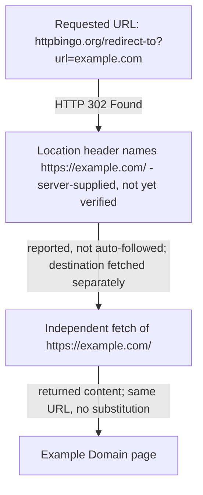

# What Example Domain Is For

Example Domain is a deliberately plain public page that exists so writers can
put a real domain into documentation examples. That is not a convention someone
has to know in advance: the page at [https://example.com/](https://example.com/)
says so in its own visible text, under a heading that reads "Example Domain".

## Reaching the page

The address that leads there in this case is not example.com itself but a test
utility:
[`https://httpbingo.org/redirect-to?url=https%3A%2F%2Fexample.com%2F`](https://httpbingo.org/redirect-to?url=https%3A%2F%2Fexample.com%2F).

A redirect target is only the server's word for where it intends to send you,
so the destination was fetched separately rather than taken on trust.

## What the page shows

Three things are visible on the destination page: the "Example Domain" heading,
a single short paragraph beneath it, and a "Learn more" link that, per the fetch
tool, points to fuller detail on IANA's site.

Requested: `https://httpbingo.org/redirect-to?url=https%3A%2F%2Fexample.com%2F`.
Observed final URL: `https://example.com/`.

The paragraph is the whole answer. It says the domain is for use in documentation
examples without needing permission, and it advises against use in operations.
Nobody has to ask before writing example.com into a manual or a code sample.

## The limits of this description

The page's text here was read through a fetch tool that summarizes HTML rather
than returning raw markup. The substance is a direct observation: heading,
purpose, permission, and caution all came from the live page on 30 August 2026.
The exact sentence boundaries and punctuation are as that tool reported them,
not byte-verified against the source markup, so treat the wording above as a
faithful report rather than a transcription.
