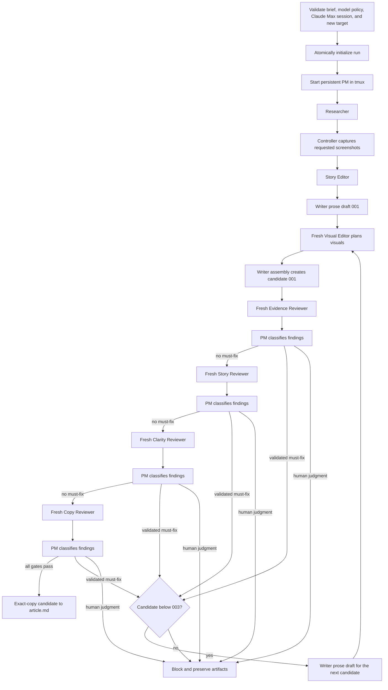

# Workflow

## Controller sequence

The controller is single-run and non-resumable. It first parses every required
level-two brief section, binds the prompt bundle, validates `models.json`
completely, and verifies that the target does not exist. When the validated
policy uses `claude_code` it then runs the sanitized `claude auth status`
preflight and continues only for a logged-in `claude.ai` Max session. Every one
of those checks fails before the run directory is created and before tmux
starts, so an invalid policy or an unusable Claude session leaves no partial
state. It builds the initial workspace in a temporary sibling directory
and commits that directory with an operating-system no-replace rename only
after initialization succeeds. A concurrently created directory or symlink is
never replaced.



Review lenses are never parallel. A must-fix stops the remaining lenses for
that candidate and the replacement restarts at Evidence. Optional and invalid
findings do not consume a candidate. A human-judgment decision blocks.

Every candidate takes the same three-pass sequence before review: a Writer
prose draft, a fresh sequential Visual Editor, then a fresh Writer assembly
invocation. The visual pass is not a candidate of its own, so the
three-candidate review budget is unchanged.

## Visual and reading-flow pass

The Writer owns article Markdown throughout. The prose draft
(`drafts/article-00N-prose.md`) is explanation only: a Mermaid block or an
inline image reference in it fails the artifact contract.

The Visual Editor then runs as a fresh sequential worker with the same
concurrency limit as any other role. It receives the brief, the outline, the
claim ledger, the current prose draft, and the controller-staged visual inputs,
and it writes `plan.md` and `plan.json` in its own workspace. It never writes a
durable candidate, never decides whether a reviewer finding is valid, and never
edits the run directory. Supported plan actions are exactly `mermaid`,
`existing_local_asset`, `restructure_text`, and `none`; there is no image quota
and no per-heading rule, and a plan whose entries are all `none` or
`restructure_text` is a valid outcome.

The Writer assembly invocation then applies the validated plan: it reproduces
each planned Mermaid diagram inside a fenced ```mermaid block, references each
planned image exactly once as `` at the staged relative path, and
shortens the explanation the visual now carries. Only that assembled candidate
(`drafts/article-00N.md`) enters review and may become `article.md`.

That inline form is the one Go checks, because it is the one a validated plan
can bind to a staged asset and to the candidate revision: every image written
that way must be a target the plan placed, at the exact staged relative path.
The scan does not stop at text it does not recognize, so a later unplanned
inline image is still found.

write-uuter is not a CommonMark or raw-HTML parser and does not try to
recognize every syntax that might render an image somewhere downstream. Other
Markdown image syntaxes and raw HTML are prohibited editorial output: the
Writer and Visual Editor contracts forbid them, and the Copy lens owns Markdown
mechanics and relative-path review. Rendering and publishing integrations stay
out of scope.

Go validates the assembly rather than trusting it: every planned diagram and
image must be present, no unplanned image reference may exist, and a candidate
that placed a diagram or an image must contain fewer explanation characters
than its prose draft, so a visual replaces prose instead of duplicating it.
Explanation characters are every non-whitespace character outside fenced blocks
and outside `` references, and the assembly assignment states the
exact count the article must stay below.

## Visual inputs

`brief.md` may carry an optional level-two `## Visual inputs` section. Each
non-empty list item names one file relative to the content root. An absent or
empty section is valid and means the run stages no local image; Mermaid and
text restructuring stay available either way.

Supported formats are PNG, JPEG, and WebP. Before the run directory is created
and before any agent starts, the controller checks the extension and the file
signature, enforces a 10 MiB per-file limit, and holds a private copy of the
bytes, so replacing the source file afterwards cannot change what an agent or a
candidate sees. Absolute paths, parent traversal, symlinked files, symlinked
path components, directories, special files, missing files, and unsupported
formats are all rejected at that point, leaving no run directory behind. Every
screenshot the controller captured joins the same pool, so evidence images are
placeable without being re-acquired. The pool is recorded in the generated
`visual-inputs.json`, which is written only when the run actually staged
something.

## Artifact gates

Go does not treat an agent's final message or process exit as completion. A
worker must exit successfully before Go reads its owned files, and may advance
only when those files exist and pass validation:

- research has non-empty sources and a claim ledger naming Fact, Firsthand
  observation, Inference, Opinion, and Unresolved;
- an optional screenshot request holds at most five entries with unique
  filename-safe IDs, a public HTTPS DNS URL, a reason, and claim IDs the ledger
  names; unknown fields and duplicate keys are rejected recursively;
- every captured image is a complete PNG of at most 10 MiB whose declared
  dimensions are inside the accepted range and pixel budget before it is
  decoded, and match its decoded ones afterwards;
- the outline records Purpose, Supporting evidence, and Reader takeaway;
- each prose draft is non-empty, has no TODO placeholder, and contains no
  Mermaid block and no inline image reference;
- each visual plan uses the supported schema version, the exact source prose
  revision, at least one evaluated opportunity, unique plain opportunity IDs, a
  supported action, a non-empty location and rationale, a fenceless diagram for
  `mermaid`, a controller-staged asset placed at most once plus meaningful alt
  text for `existing_local_asset`, and nothing extra for `restructure_text` or
  `none`; unknown fields and duplicate keys are rejected recursively, and
  `plan.md` must record every opportunity ID and its action;
- each assembled candidate is non-empty, has no TODO placeholder, contains
  every planned diagram and image, writes every supported inline image
  reference at a target the plan placed, and holds fewer explanation characters
  than its prose draft whenever it placed one;
- each candidate manifest and every regular file it names still hash to the
  recorded bytes before review begins and again at publication;
- reviewer JSON has an allowed status, exact lens and SHA-256 revision, unique
  complete findings, plus a report with the same finding fields;
- PM decisions cover every finding, use allowed classifications, match the
  current revision, explain every invalid classification, and preserve the
  exact accepted classifications and routing outcome of every earlier lens.

A reviewer changing its candidate or a staged visual asset is an
artifact-contract failure. Stale lens or revision metadata is rejected rather
than retried into a passing state.

## Candidate revision

The reviewed revision covers the assembled Markdown and the bytes of every
referenced local asset, so a visual cannot be replaced after its candidate
passed review. A candidate that references no local asset keeps the SHA-256 of
its Markdown, which leaves runs without visual assets unchanged. Any referenced
asset makes the revision the SHA-256 of this canonical block, with assets in
lexicographic path order:

```text
write-uuter/candidate-revision/v1
article sha256:<article digest>
assets <count>
<asset path> sha256:<asset digest>
```

The controller recomputes that revision from the durable bytes before each
lens starts, at the publication boundary, and again after the succeeded state
is persisted.

## Screenshot capture

Between the Researcher and every later role, the controller delegates a
validated request batch to the absolute executable in
`WRITE_UUTER_CAPTURE_RUNNER`. It uses a private workspace and the fixed
version-2 artifact protocol documented in [artifacts](artifacts.md), never a
shell command. No agent receives provider credentials, direct browser/MCP
access, provider options, or a raw provider response. The checked-in Cloudflare
adapter preserves the previous public-page PNG behavior with a fixed 1280x800
viewport, sequential request order, a 60-second per-request timeout, and no
fallback backend.

A run whose Researcher requested nothing skips this step entirely and needs no
runner or provider credential. Otherwise a missing/unhealthy runner, invalid
request, nonzero exit, timeout, partial output, invalid/ambiguous result, extra
file, unsafe path or file type, invalid/oversized PNG, or metadata/digest
mismatch blocks before the Story Editor and Writer. Runner output is never
copied into diagnostics. The controller terminates the owned process tree and
verifies removal of the private workspace on both success and failure.

Successful initial captures are stored as read-only
`evidence/assets/screenshots/<id>.png`; a replacement attempt is stored under
`evidence/assets/screenshots/attempts/<id>/attempt-002.png`, which cannot alias
another request's initial path. Both are recorded in a controller-generated
`evidence/screenshots.json`. A first request-keyed editorial rejection permits
one fresh runner invocation with neutral prior-attempt provenance. The second
capture is evaluated independently; a second rejection is persisted as an
explicit non-placement and stops without another retry. Writer
and Evidence Reviewer receive both as read-only context; the manifest joins the
prompt and the images are staged as files, never inlined into an assignment.
The Visual Editor receives the manifest and currently adoptable images through
the visual input pool, so a capture can be placed where it helps. A twice
rejected capture remains durable evidence but is not staged for later
candidates.
Only the Evidence lens receives the image bytes, and it must reject a
screenshot that does not visibly contain the information its `supports` claim
names - a valid PNG proves nothing about content.

## Lifecycle and terminal states

The PM starts before research, atomically publishes its protocol-ready marker,
and remains active while Go starts one worker window at a time. Go verifies
both the PM Codex process identity and this application-level handshake before
starting any worker, and rechecks PM liveness before accepting worker output.
Each role runs in a fresh private workspace outside the run
directory, launched through a provider-neutral runner with the explicit
provider, model, and reasoning effort its policy role declares. The immutable
invocation record is published before the process is treated as ready. Go stages only its allowed inputs, waits for a natural successful
exit marker and tmux-window disappearance, validates output without following
symlinks, and then copies regular files into the run. The marker is published
by a same-directory temporary-file rename only after the Codex process and its
descendants are gone. The controller-private runner, ancestry ownership
manifests/ready records,
live PM requests, and other launch-critical state are siblings of—not children
of—agent workspaces. A default-deny macOS native sandbox gives agents only
system runtime reads plus their current workspace and isolated Codex home; it
denies unrelated host, durable-run, prior-lens, PM, and controller-private
access. Controller-only test paths never become sandbox rules or agent
environment variables. The private runner follows parent/child edges through
the native process table and durably records precise kernel process identities
for controller-launched and controller-trackable descendants, including
children that create a new session or process group. An intentionally
ancestry-escaping hostile process is outside this slice's guarantee; complete
containment is deferred to a future container/VM design.
Cleanup opens stable kernel process handles before signaling each recorded
identity, so a reused bare PID is never treated as owned. Each lens uses a
fresh Codex invocation.

Every agent has the configured timeout, and tmux lifecycle commands have their
own short bound. The controller enforces both a context timer and an absolute
wall-clock deadline, so host sleep or a missing runner completion marker cannot
extend an invocation past its contract. A timeout, premature exit, malformed
artifact, stale review,
cleanup failure, human decision, or exhausted candidate budget sets an
actionable `workflow.json.block_reason`. Success requires verified absence of
the dedicated tmux session and every invocation identity. On success the
controller also requires the persistent PM to still be live,
then revalidates the candidate hash, every final review, each PM request
binding, and each accepted classification list before publishing `article.md`
and durably persisting the succeeded state. Publication is a single
root-relative atomic no-replace rename inside the run directory, so a competing
`article.md` created concurrently is never replaced and the run blocks instead.
A failure during that terminal transition removes `article.md` only while it is
still the exact file identity this controller committed, records blocked state,
and attempts private-state cleanup even if blocked-state persistence fails; an
`article.md` this run never committed is left untouched. Ordinarily the blocked
path also verifies that no PM, worker, or detached descendant remains. If
signaling or absence verification itself fails, the controller records that
cleanup failure and archives the available audit files. Staged Codex
credentials are not removed at that point. They are retained until every
retained stable process-ownership identity the controller recorded has exited
and the private-path scan is clean; only then are they removed, and the
removal is verified. While any owned identity is still live the credential
copies stay in place and the blocking identities are reported instead. The
non-secret ownership and control state is retained across both outcomes, so
cleanup can be diagnosed and retried after the credentials are gone. That
exceptional blocked result does not claim process absence.

Parallel runs, resume after controller restart, and editing completed runs are
not implemented.
