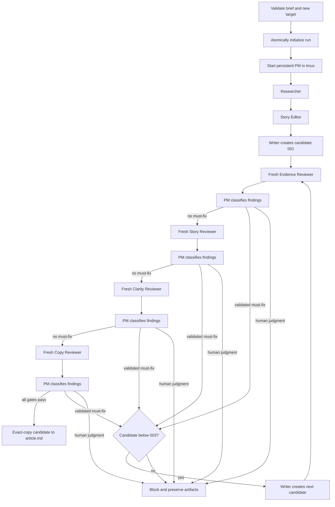

# Workflow

## Controller sequence

The issue-1 implementation is a single-run, non-resumable controller. It first
parses every required level-two brief section and verifies that the target does
not exist. It builds the initial workspace in a temporary sibling directory
and commits that directory with an operating-system no-replace rename only
after initialization succeeds. A concurrently created directory or symlink is
never replaced.

Review lenses are never parallel. A must-fix stops the remaining lenses for
that candidate and the replacement restarts at Evidence. Optional and invalid
findings do not consume a candidate. A human-judgment decision blocks.

## Artifact gates

Go does not treat an agent's final message or process exit as completion. A
worker must exit successfully before Go reads its owned files, and may advance
only when those files exist and pass validation:

- research has non-empty sources and a claim ledger naming Fact, Firsthand
  observation, Inference, Opinion, and Unresolved;
- the outline records Purpose, Supporting evidence, and Reader takeaway;
- each candidate is non-empty and has no TODO placeholder;
- reviewer JSON has an allowed status, exact lens and SHA-256 revision, unique
  complete findings, plus a report with the same finding fields;
- PM decisions cover every finding, use allowed classifications, match the
  current revision, explain every invalid classification, and preserve the
  exact accepted classifications and routing outcome of every earlier lens.

A reviewer changing its candidate is an artifact-contract failure. Stale lens
or revision metadata is rejected rather than retried into a passing state.

## Lifecycle and terminal states

The PM starts before research and remains active while Go starts one worker
window at a time. Each role runs in a fresh private workspace outside the run
directory. Go stages only its allowed inputs, waits for a natural successful
exit marker and tmux-window disappearance, validates output without following
symlinks, and then copies regular files into the run. The marker is published
by a same-directory temporary-file rename only after the Codex process and its
descendants are gone. The controller-private runner, process-group records,
live PM requests, and other launch-critical state are siblings of—not children
of—agent workspaces. The macOS native sandbox denies agents access to those
paths, the durable run, other role workspaces, and host files outside the
active workspace. Each lens uses a fresh Codex invocation.

Every agent has the configured timeout, and tmux lifecycle commands have their
own short bound. The controller enforces both a context timer and an absolute
wall-clock deadline, so host sleep or a missing runner completion marker cannot
extend an invocation past its contract. A timeout, premature exit, malformed
artifact, stale review,
cleanup failure, human decision, or exhausted candidate budget sets an
actionable `workflow.json.block_reason`. Go verifies that the dedicated tmux
session and every recorded invocation process group are gone before either
terminal result. On success it requires the persistent PM to still be live,
then revalidates the candidate hash, every final review, each PM request
binding, and each accepted classification list before publishing `article.md`
and durably persisting the succeeded state. A failure during that terminal
transition removes `article.md`, records blocked state, attempts private-state
cleanup even if blocked-state persistence fails, and leaves no PM, worker, or
detached descendant process for the run.

Parallel runs, resume after controller restart, and editing completed runs are
not implemented.
