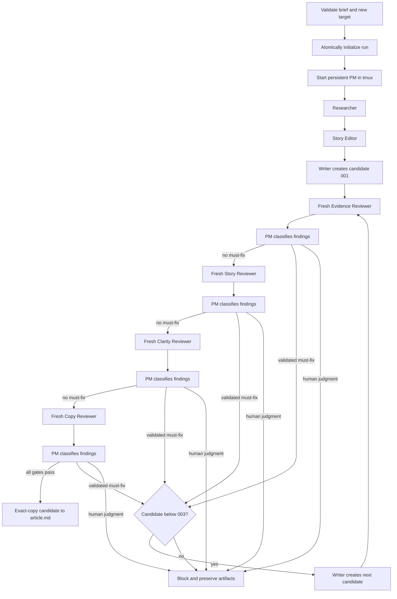

# Workflow

## Controller sequence

The issue-1 implementation is a single-run, non-resumable controller. It first
parses every required level-two brief section and verifies that the target does
not exist. It builds the initial workspace in a temporary sibling directory
and renames that directory into place only after initialization succeeds.

Review lenses are never parallel. A must-fix stops the remaining lenses for
that candidate and the replacement restarts at Evidence. Optional and invalid
findings do not consume a candidate. A human-judgment decision blocks.

## Artifact gates

Go does not treat an agent's final message or process exit as completion. A
worker may advance only when its owned files exist and pass validation:

- research has non-empty sources and a claim ledger naming Fact, Firsthand
  observation, Inference, Opinion, and Unresolved;
- the outline records Purpose, Supporting evidence, and Reader takeaway;
- each candidate is non-empty and has no TODO placeholder;
- reviewer JSON has an allowed status, exact lens and SHA-256 revision, unique
  complete findings, plus a report with the same finding fields;
- PM decisions cover every finding, use allowed classifications, match the
  current revision, and explain every invalid classification.

A reviewer changing its candidate is an artifact-contract failure. Stale lens
or revision metadata is rejected rather than retried into a passing state.

## Lifecycle and terminal states

The PM starts before research and remains active while Go starts one worker
window at a time. Each worker receives a generated assignment composed from a
version-controlled prompt and is terminated as soon as its artifact contract
validates. Each lens uses a fresh Codex invocation.

Every agent has the configured timeout. A timeout, premature exit, malformed
artifact, stale review, human decision, or exhausted candidate budget sets an
actionable `workflow.json.block_reason`. Go kills the dedicated tmux session
before returning from either success or blocked execution, leaving no PM or
worker process for the run.

Parallel runs, resume after controller restart, and editing completed runs are
not implemented.
