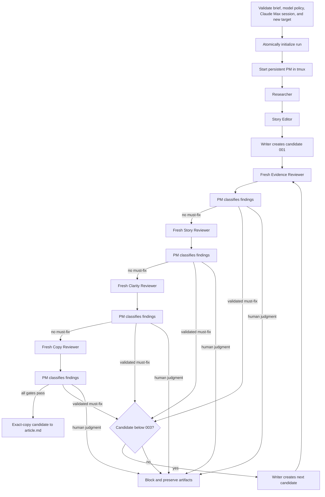

# Workflow

## Controller sequence

The controller is single-run and non-resumable. It first parses every required
level-two brief section, binds the prompt bundle, validates `models.json`
completely, and verifies that the target does not exist. When the validated
policy uses `claude_code` it then runs the sanitized `claude auth status`
preflight and continues only for a logged-in `claude.ai` Max session. Every one
of those checks fails before the run directory is created and before tmux
starts, so an invalid policy or an unusable Claude session leaves no partial
state. It builds the initial workspace in a temporary sibling directory
and commits that directory with an operating-system no-replace rename only
after initialization succeeds. A concurrently created directory or symlink is
never replaced.

Review lenses are never parallel. A must-fix stops the remaining lenses for
that candidate and the replacement restarts at Evidence. Optional and invalid
findings do not consume a candidate. A human-judgment decision blocks.

## Artifact gates

Go does not treat an agent's final message or process exit as completion. A
worker must exit successfully before Go reads its owned files, and may advance
only when those files exist and pass validation:

- research has non-empty sources and a claim ledger naming Fact, Firsthand
  observation, Inference, Opinion, and Unresolved;
- the outline records Purpose, Supporting evidence, and Reader takeaway;
- each candidate is non-empty and has no TODO placeholder;
- reviewer JSON has an allowed status, exact lens and SHA-256 revision, unique
  complete findings, plus a report with the same finding fields;
- PM decisions cover every finding, use allowed classifications, match the
  current revision, explain every invalid classification, and preserve the
  exact accepted classifications and routing outcome of every earlier lens.

A reviewer changing its candidate is an artifact-contract failure. Stale lens
or revision metadata is rejected rather than retried into a passing state.

## Lifecycle and terminal states

The PM starts before research, atomically publishes its protocol-ready marker,
and remains active while Go starts one worker window at a time. Go verifies
both the PM Codex process identity and this application-level handshake before
starting any worker, and rechecks PM liveness before accepting worker output.
Each role runs in a fresh private workspace outside the run
directory, launched through a provider-neutral runner with the explicit
provider, model, and reasoning effort its policy role declares. The immutable
invocation record is published before the process is treated as ready. Go stages only its allowed inputs, waits for a natural successful
exit marker and tmux-window disappearance, validates output without following
symlinks, and then copies regular files into the run. The marker is published
by a same-directory temporary-file rename only after the Codex process and its
descendants are gone. The controller-private runner, ancestry ownership
manifests/ready records,
live PM requests, and other launch-critical state are siblings of—not children
of—agent workspaces. A default-deny macOS native sandbox gives agents only
system runtime reads plus their current workspace and isolated Codex home; it
denies unrelated host, durable-run, prior-lens, PM, and controller-private
access. Controller-only test paths never become sandbox rules or agent
environment variables. The private runner follows parent/child edges through
the native process table and durably records precise kernel process identities
for controller-launched and controller-trackable descendants, including
children that create a new session or process group. An intentionally
ancestry-escaping hostile process is outside this slice's guarantee; complete
containment is deferred to a future container/VM design.
Cleanup opens stable kernel process handles before signaling each recorded
identity, so a reused bare PID is never treated as owned. Each lens uses a
fresh Codex invocation.

Every agent has the configured timeout, and tmux lifecycle commands have their
own short bound. The controller enforces both a context timer and an absolute
wall-clock deadline, so host sleep or a missing runner completion marker cannot
extend an invocation past its contract. A timeout, premature exit, malformed
artifact, stale review,
cleanup failure, human decision, or exhausted candidate budget sets an
actionable `workflow.json.block_reason`. Success requires verified absence of
the dedicated tmux session and every invocation identity. On success the
controller also requires the persistent PM to still be live,
then revalidates the candidate hash, every final review, each PM request
binding, and each accepted classification list before publishing `article.md`
and durably persisting the succeeded state. Publication is a single
root-relative atomic no-replace rename inside the run directory, so a competing
`article.md` created concurrently is never replaced and the run blocks instead.
A failure during that terminal transition removes `article.md` only while it is
still the exact file identity this controller committed, records blocked state,
and attempts private-state cleanup even if blocked-state persistence fails; an
`article.md` this run never committed is left untouched. Ordinarily the blocked
path also verifies that no PM, worker, or detached descendant remains. If
signaling or absence verification itself fails, the controller records that
cleanup failure and archives the available audit files. Staged Codex
credentials are not removed at that point. They are retained until every
retained stable process-ownership identity the controller recorded has exited
and the private-path scan is clean; only then are they removed, and the
removal is verified. While any owned identity is still live the credential
copies stay in place and the blocking identities are reported instead. The
non-secret ownership and control state is retained across both outcomes, so
cleanup can be diagnosed and retried after the credentials are gone. That
exceptional blocked result does not claim process absence.

Parallel runs, resume after controller restart, and editing completed runs are
not implemented.
