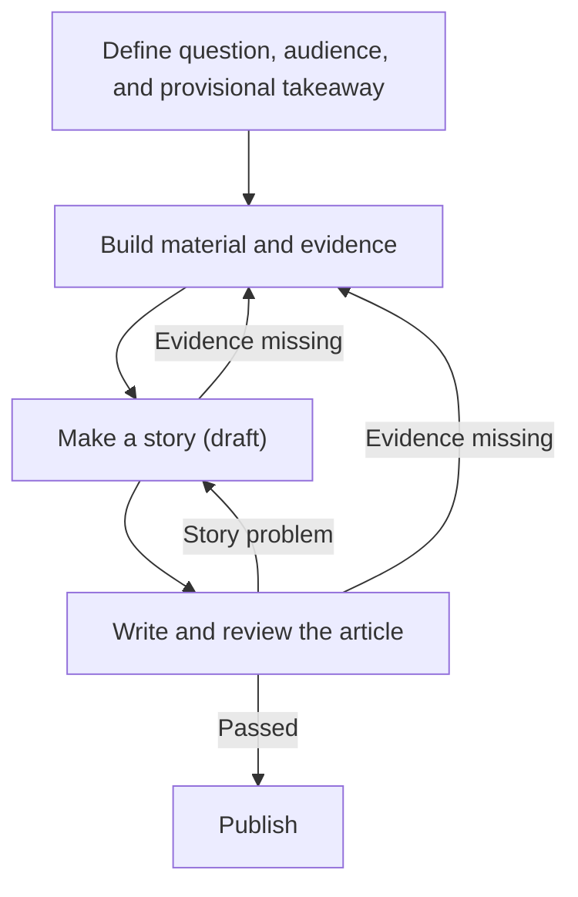
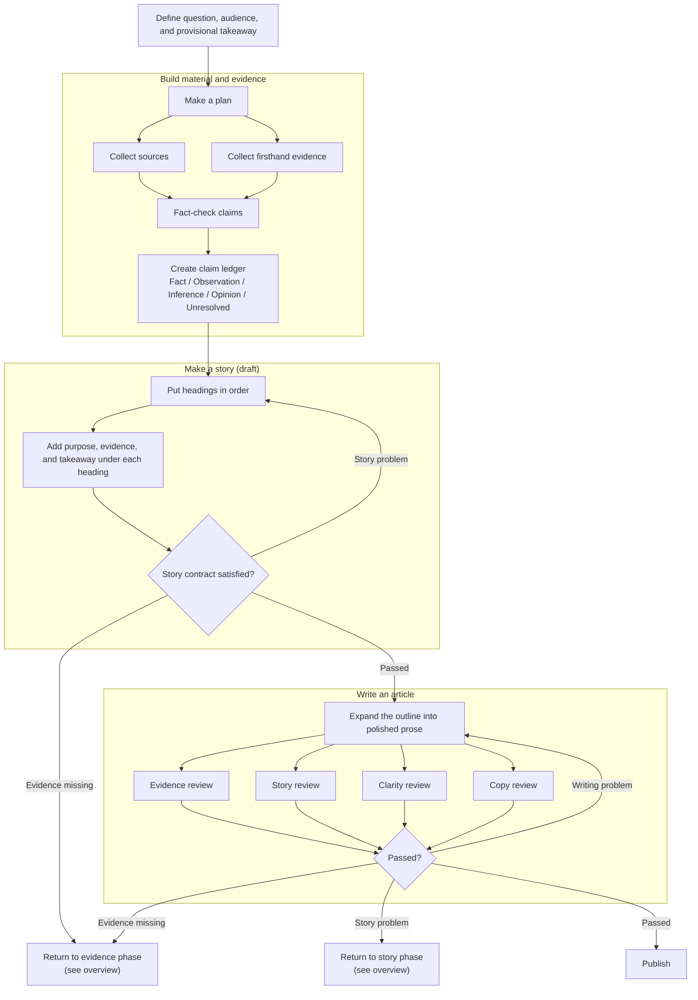

# Workflow

## Overview

The overview contains the cross-phase return paths. Keep this diagram small so
that the complete process remains readable at a glance.

## Detailed flow

The detailed diagram shows the normal direction and local correction loops.
Cross-phase returns terminate at an explicit routing result; the PM follows the
return path defined in the overview.

## Routing rule

The PM validates review findings and routes them to the role that owns the
problem. A reviewer never changes the workflow phase or edits the article
directly.

